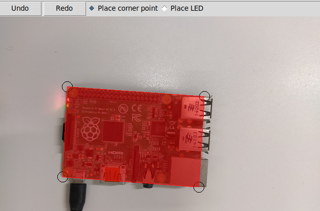

.. _bdg:

BDG
---

General approach
~~~~~~~~~~~~~~~~
The Board Description Generator (BDG) is a tool which allows to generate description files for boards. For doing so, a
picture of the board is needed which will serve as reference image for the BSP.

The picture should meet the following criteria: well lightning conditions, board is fully visible and not too small.
Generally, the window is resizable and the content will be scaled accordingly. The radius of the LEDs will be adjusted
as well.

.. note::
    Although resizing the windows is possible, the actual image will be saved in the original resolution.

Place board corner points
~~~~~~~~~~~~~~~~~~~~~~~~~

With the BDG such an image can be loaded and edited. The BDG ca be operated in two modes 'Place corner point' or 'Place LED'.
In 'Place corner point' mode, corner points can be placed. These corner points are intended to mark the corners of the
board in the picture.

    An example where a picture of a raspberry pi is loaded and the corners points have been placed.

The selected area will be used by the BSP to perform a feature detection, so the resolution should be around full hd for
for better results in the detection.

Place LEDs
~~~~~~~~~~

In the second mode markers for the LEDs can be placed. For each placed LED there is an entry for the name or function
and checkboxes for the possible colors on the right hand side of the window. The index of the LED is displayed in the
list and on the lower left corner of each LED as well. By using the mousewheel the radius of the circles can be adjusted.

The BSP will use these regions to detect the status of the LED.
