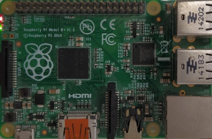

.. _bsp:

BSP
---

General approach
~~~~~~~~~~~~~~~~

Based on the reference image, features are extracted with SIFT and matched with 'knn nearest' in the target image.
The matching allows to calculate the homography matrix which describes the rotation and scaling difference between the
reference and target image. With the difference known, it is possible to calculate relative coordinates from the reference
into absolut coordinates in the target image. Consequently, the coordinates of the LEDs can be calculated and
regions of interest (ROI) can be extracted.

    An example for a reference picture of a Raspberry Pi model B+
    The image shows the board from above and is cropped to the corner points of the board. Such reference data can be
    generated with the BDG and is necessary for providing the state of the board in a target image.

State Table
"""""""""""
The next step is to detect whether the LEDs shown in the ROIs are powered on or off and in addition if they are on the
color can be determined. The so gained information will be saved in the state_table which contains a list of
StateEntries:

.. list-table:: State_Entry
    :header-rows: 1

    * - name
      - current_state
      - last_time_on
      - last_time_off
      - hertz
    * - String
      - LEDState
      - Timestamp
      - Timestamp
      - Float

The frequency saved in the attribute 'hertz' will be calculated by the detector when the first change between on and off
occurs.
Changes of the table will then be forwarded to MQTT.

Sequence diagram
""""""""""""""""

.. uml:: ../uml/State_Detector_Sequence.puml
   :align: center
   :caption: The communication between the classes of the BSP

The classes of the BSP
~~~~~~~~~~~~~~~~~~~~~~

State Detector
""""""""""""""
The main entry point for accessing the BSP. Takes a Board object and the webcam id.

First of all, the stream has to be opened with open_stream(). This is necessary for the tests to be able
to pass a mock video capture which works with an already recorded video. Consequently, if the video capture passed is
None, the open stream method will open one based on the webcam_id.

.. note::
    The open_stream uses a BufferlessVideoCapture the State Detector always needs the most recent picture. As the
    processing normally takes longer than the time of new frames to arrive, effectively frames will be dropped.

The current states will be saved in the state table and are meant to be accessible from the outside. Updates are placed
by altering the existing entry in the list and not by creating a new one.

.. warning::
    The order of the state table entries or the content shall not be changed.

.. automodule:: src.BSP.state_detector
    :members:

Board Orientation
"""""""""""""""""
The board orientation object is responsible for the information associated with where the board is
in a target image. Naturally, if queried with new images this might not be true anymore as the board could have been
moved for instance.

For this the object has a timestamp of its creation indicating the time of the calculation, allowing to recalculate
the orientation after some time.

The object allows to store the current orientation with the homography matrix, so it is always relative to the image
used for the calculation of the homography matrix.

The corners represent the corners of the board, consequently it is assumed that the board is at least rectangular.
If the board does not have the required shape, a rectangular selection can be used for the matching as well.

.. automodule:: src.BSP.BoardOrientation
    :members:

Led State
"""""""""

.. automodule:: src.BSP.led_state
    :members:

State Table Entry
"""""""""""""""""

.. automodule:: src.BSP.state_table_entry
    :members:

Homography Provider
"""""""""""""""""""
The homography provider is responsible for providing the board orientation, especially the homography matrix which
is inside the BoardOrientation object.

.. automodule:: src.BSP.homographyProvider
    :members:

Bufferless Video Capture
""""""""""""""""""""""""

.. automodule:: src.BSP.BufferlessVideoCapture
    :members:

Led Extractor
"""""""""""""
Responsible for extracting the ROIs of the LEDs by the given LED objects and the board orientation.
In addition it fills the squares except the circles of the LEDs with gray color.

Returns a list of numpy arrays, the ROIs of the LEDs in the same order as in the LED object list.

.. automodule:: src.BSP.led_extractor
    :members:

Test coverage
"""""""""""""

The BSP has a blackbox test which runs a detection of LEDs on a Raspberry Pi. As this yields not precise tests
more unit tests a possible but currently not planed.

Example (Outdated)
""""""""""""""""""

Following example calculates the orientation of the board, translates relative coordinates into
absolute in the target image and finally extracts the roi for the LEDs.

(Outdated: in the current version this examples does not work anymore)

.. code-block:: python

    #Loading the reference image
    ref = cv2.imread("referenceCropped.jpg", cv2.IMREAD_COLOR)
    #Loading the target image
    img = cv2.imread("targetImage.jpg", cv2.IMREAD_COLOR)
    #Calculate orientation of board in target
    board_orientation = homography_by_sift(ref, img)
    led_centers = np.float32([[2, 38], [2, 57]])
    #Extract ROI from target
    leds = get_led_roi(board_orientation, (ref.shape[0], ref.shape[1]), led_centers)
    #Show LEDs
    cv2.imshow("Led1", leds[0])
    cv2.imshow("Led2", leds[1])
    cv2.waitKey(0)
