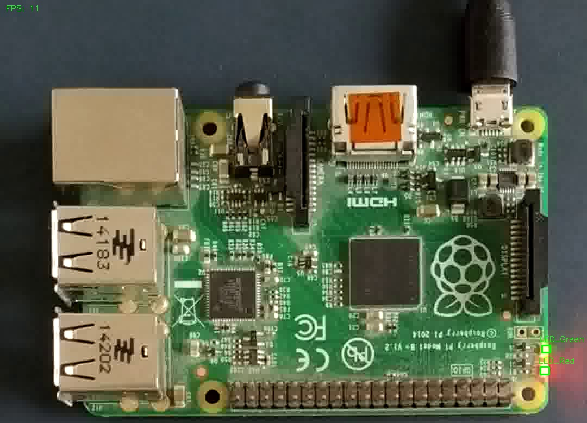

.. _bsv:

BSV
---

Purpose
~~~~~~~

An additional tool which displays the video stream with the status of the LEDs annotated. Can be used for debugging
purposes.

    The picture shows the board state visualizer for the a raspberry pi. In this case the LEDs are both on.

Explanation
~~~~~~~~~~~

* In the top left corner the current frame rate per second is displayed

* The LEDs do have a bounding box either in green or red. The color indicates the detected state: red -> off, green -> on.

* The name is displayed above the LEDs

Usage
~~~~~

Can be started with the **-v** or **--visualizer** flag in the :ref:`CLI <cli>`.
A rtmp stream with the annotated frames on port 8080 will be started. With the `ffplay <https://ffmpeg.org/ffplay.html>`_ command this stream can be
displayed.