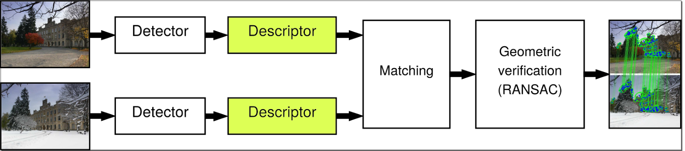
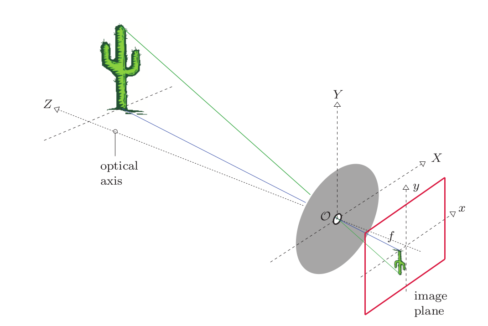
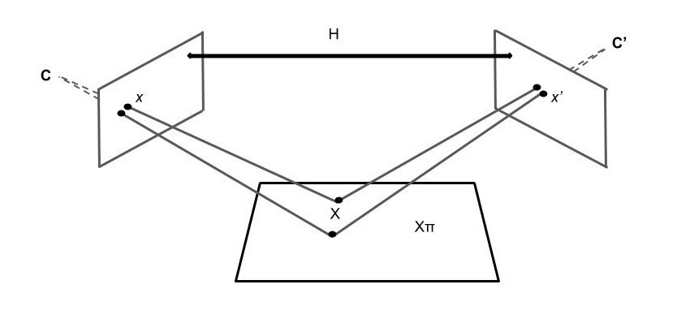

.. _homography_pipeline:

Homography Pipeline
====================

The homography pipeline provides a homography matrix for estimating the transformation between two images.
With this matrix, it is possible to calculate the locations of the led coordinates in the second image
with the prior knowledge of the location of the leds in the reference image.

The classical Pipeline
----------------------

    The general pipeline for the homography estimation. Source: https://ducha-aiki.medium.com/are-all-sifts-created-equal-part-1-1dbdc565bffb

There are 5 basic steps for getting the homography matrix of an image pair:
    1. Detection of Keypoints which are repeatable structures in the images.
    2. Description of the Keypoints which means that the patches are converted to an vector.
    3. Matching of the description vectors of the two images.
    4. Ransac to get the best homography matrix.
    5. Refinement of the homography matrix.

Keypointdetection
------------------

There are several options for the keypoint detection.

The Homography Matrix
----------------------
The homography matrix describes projection of on plane onto another plane.
With this matrix, it is possible to calculate the locations of the led coordinates in the second image
with the prior knowledge of the location of the leds in the reference image.

The basic theory
----------------

We have two images, the first one is the reference image, the second one is the image we get from our webcam stream.

Given the coordinates of the leds in the reference image.

.. math::
    \text{LED_ref} = \begin{bmatrix} x \\ y\end{bmatrix}

as well the coordinates of the leds in the image we get from our webcam.

.. math::
    \text{LED_target} = \begin{bmatrix} \hat{x} \\ \hat{y}\end{bmatrix}

Since we know the PCB in the reference is the same as in the webcam image, 
we can interpret the webcam image as a projection of our reference image.
For that we need a transformation matrix H.

.. math::
  \hat{P} = HP

The transformation matrix H is the homography matrix.\\
Since the transformation also includes the scaling, it wouldn't be an affine transformation in the 2D space.
So we need to project our coordinates into the 3D space.
If you don't know what homogenous coordinates are, you can read about it here: https://www.tomdalling.com/blog/modern-opengl/explaining-homogenous-coordinates-and-projective-geometry/
Since we can see our image also as a plane, we can simply add a 1 to the coordinates.
So our projection point is:

.. math::
  \begin{bmatrix} x_a \\ y_a \\ z_a \end{bmatrix} =  H \begin{bmatrix} x \\ y \\ 1\end{bmatrix}

To calibrate our projection we need to divide it by its z-coordinate.

.. math::
  \begin{bmatrix} \hat{x} \\ \hat{y} \\ 1 \end{bmatrix} = \frac{1}{z_a} \begin{bmatrix} x_a \\ y_a \\ z_a \end{bmatrix}  \\
  z_a \begin{bmatrix} \hat{x} \\ \hat{y} \\ 1 \end{bmatrix} = \begin{bmatrix} x_a \\ y_a \\ z_a \end{bmatrix}

Altogether we get the following equation for our projection:

.. math::
  \begin{bmatrix} \hat{x} \\ \hat{y} \\ 1 \end{bmatrix} = \frac{1}{z_a} H \begin{bmatrix} x \\ y \\ 1 \end{bmatrix}

But how can we calculate the homography matrix?
~~~~~~~~~~~~~~~~~~~~~~~~~~~~~~~~~~~~~~~~~~~~~~~~
As said in the previous section, the homography matrix is used to project the coordinates from one plane to another.  

To understand that we first need to understand how we project an 3D point to a point in arbitrary space.
The projection of an 2D point onto a 3D plane can be described with the Pin Hole Camera Model.
This model is a simple model of a camera that projects a 3D image (our real world) onto a plane (the sensor) .

Pin Hole Camera Model source: https://towardsdatascience.com/image-processing-class-egbe443-0-1-image-aquisition-7e80cc89de84

Let's consider the 3D world as a 3-tuple:

.. math::

  \begin{bmatrix} X_w \\ Y_w \\ Z_w \end{bmatrix}

For mapping the 3D world to an image we multiply it with the intrinsic and extrinsic camera matrix:

.. math::
  \begin{bmatrix} x_a\\ y_a \\ z_a \end{bmatrix} = C_{\text{int}}C_{\text{ext}}\begin{bmatrix} x \\ y \\ z \\ 1 \end{bmatrix}

The intrinsic matrix is the matrix describes the focal length, the principal point and the skew. 
Whereas the extrinsic matrix describes the position of the camera.
It describes the rotation and the translation of the camera.

.. math::
  \begin{bmatrix} u \\ v \\ w \end{bmatrix} = \underbrace{\begin{bmatrix}f_x && 0 && c_x && 0 \\ 0 && f_y && c_y && 0 \\ 0 && 0 && 1 && 0  \end{bmatrix}}_{\text{Camera Intrinsic}}\underbrace{\begin{bmatrix} r_{11} && r_{12} && r_{13} && {t_1} \\ r_{21} && r_{22} && r_{23} && t_2 \\ r_{31} && r_{32} && r_{33} && t_3 \\ 0 && 0 && 0 && 1 \end{bmatrix}}_{\text{Camera extrinsic}} \begin{bmatrix} X \\ Y \\ Z \\ 1 \end{bmatrix}

Those two matrices are combined to get the camera matrix.

.. math::
  C = \begin{bmatrix} C_{11} && C_{12} && C_{13} && C_{14} \\ C_{21} && C_{22}  && C_{23} &&  C_{24} \\ C_{31}v && C_{32} && C_{33} && C_{34}\end{bmatrix}

So the projection of a 3D point to an image is:

.. math::
  \begin{bmatrix} \tilde{u} \\ \tilde{v} \\ \tilde{w} \end{bmatrix} = C \begin{bmatrix} X \\ Y \\ Z \\ 1 \end{bmatrix}

If you need more information about the camera model, you can read about it here: https://en.wikipedia.org/wiki/Pinhole_camera_model

In our case we project the reference image as well as the webcam image to the same "world".

Because our world is flat we can choose the z coordinate to be 0.

.. math::
  \begin{bmatrix} \tilde{u} \\ \tilde{v} \\ \tilde{w} \end{bmatrix} =  \begin{bmatrix} C_{11} && C_{12} && C_{13} && C_{14} \\ C_{21} && C_{22} && C_{23} &&  C_{24} \\ C_{31}v && C_{32} && C_{33} && C_{34}\end{bmatrix} \begin{bmatrix} x \\ y \\ 0 \\ 1\end{bmatrix}

Because of that all we can remove the third column of our Camera matrix since while multiplying with Z (which is 0) we get 0.

.. math::
  \begin{bmatrix} \tilde{u} \\ \tilde{v} \\ \tilde{w} \end{bmatrix} =  \begin{bmatrix} C_{11} && C_{12} && && C_{14} \\ C_{21} && C_{22} && &&  C_{24} \\ C_{31}v && C_{32} && && C_{34}\end{bmatrix} \begin{bmatrix} x \\ y \\  \\ 1\end{bmatrix}

Now we have a 3x3 matrix which is our homography matrix.
We can estimate it if we have at least 4 points in the reference image and at least 4 points in the webcam image.

The calculation is done by linear algebra by multiplying with the pseudo-inverse of P.

.. math::
  H P = Q \\
  H P P^T = Q P^T \\
  H = Q P^T (P P^T)^{-1} \\

